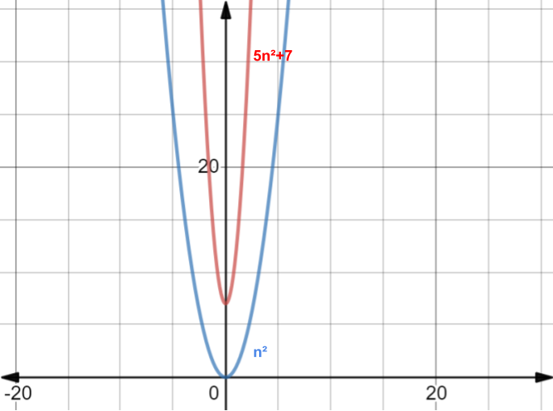
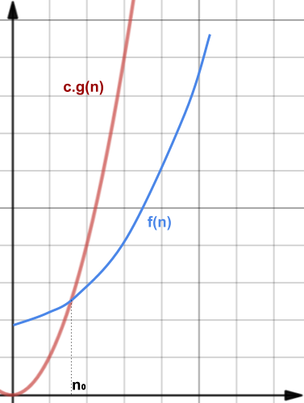
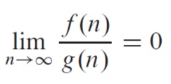
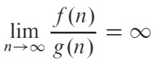
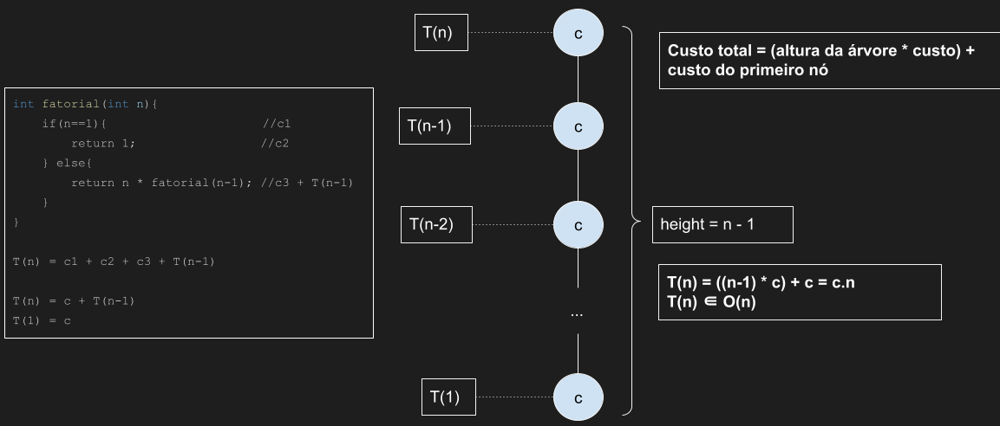
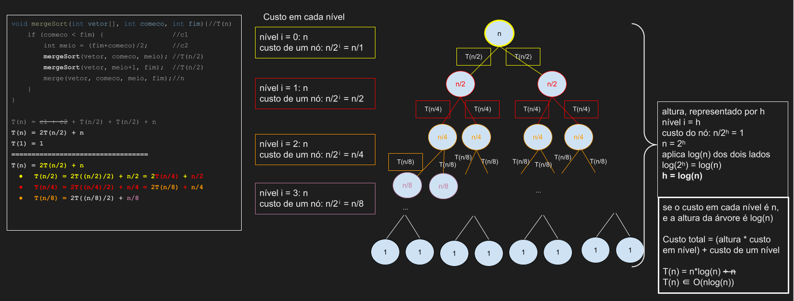
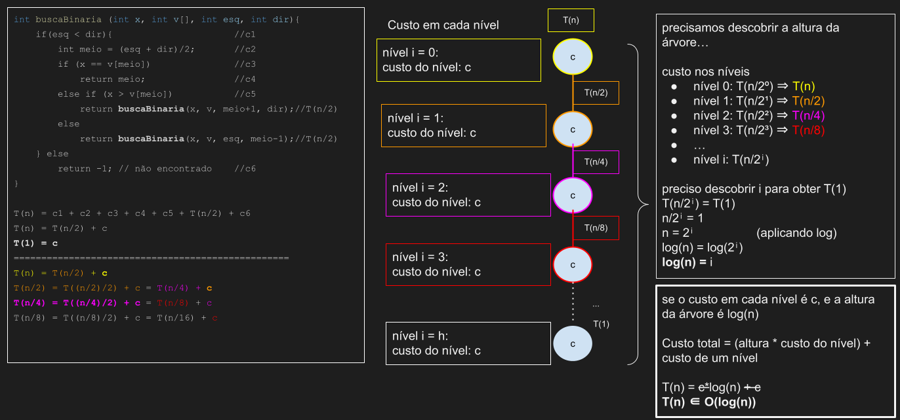

# Análise Assintótica de Algoritmos

## Motivação

**Por que devemos nos importar com a complexidade de tempo de um algoritmo?**

Uma situação que expõe com clareza a importância da análise de algoritmos é quando duas pessoas resolvem comparar suas soluções para um mesmo problema.

Imaginem que eu tenha solicitado para dois alunis, Daniel e Marina, que eles criem uma função que *recebe um número natural e retorna verdadeiro **se o número for primo**, e falso caso contrário*.

Daniel, ávido por resolver o problema, escreveu uma função que percorria de i=2 até i<n, e para cada iteração verificava se n era divisível por este valor.

```c
//Daniel
bool ehPrimo(unsigned int n){
    for(int i = 2; i < n; i++){
        if(n%i==0){
            return false;
        }
    }
    return true;
} 
``` 

Marina pensou um pouco mais e percebeu que se um número não possuir divisor até a raiz quadrada de n, então ele será primo.

```c
//Marina
bool ehPrimo(unsigned int n){

    //tiramos do for para computar a raiz quadrada apenas uma vez
    //a complexidade de sqrt(n) é lg(n), mas para simplificar a introdução, assuma que é O(1)

    double lim = sqrt(n);   
    for(int i = 2; i <= lim; i++){
        if(n%i==0){
            return false;
        }
    }
    return true;
} 

//sobre sqrt(n): https://stackoverflow.com/questions/23103847/what-is-the-time-complexity-of-the-following-function
``` 

É fácil perceber que se n for primo, o algoritmo de Marina executará menos instruções, sendo, portanto, mais eficiente.
Note que as análises de desempenho sempre focam no pior caso, isto é, a função sendo chamada com um argumento que force a execução da maior quantidade de instruções possível, ou seja, casos em que o número é primo.
O fato é que quando ambos executarem seus programas para valores muito altos de n, o programa de Daniel demorará demais, enquanto que o programa da Marina executará em um período de tempo viável.
Se assumirmos que ambos os computadores levam **1ms para realizar uma divisão** (apenas para fins de comparação), vamos ver quanto tempo os programas de Daniel e Marina levariam para executar se recebessem como entrada os seguintes valores para n: 11, 101, 10⁶ + 3, 10¹⁰ + 19. 

| n | Daniel (n-2) | Marina (sqrt(n)-1)|
| -------- | ---------- | ----------- |
| 11 | 9ms | sqrt(11)-1 = 2ms|
| 101 | 99ms | sqrt(101)-1 = 9ms |
| 10⁶ + 3 | 10⁶ms = 1000s = 16.6min| sqrt(10⁶)+3-1 = 1002ms = 1s |
| 10¹⁰ + 19 | 10.000.000.019ms = 10000000s = 115.74 dias| sqrt(10¹⁰)+19-1 = 100018ms = 100s = 1.6min |

A partir da tabela anterior, é possível observar que apesar do programa de Daniel ser extremamente rápido para valores muito pequenos de n, ele pode levar dias para valores muito grandes (e.g., 10¹⁰ + 19), enquanto o programa de Marina leva pouco mais de 1 minuto.

Ao analisar um algoritmo, um ponto estudado é a *complexidade de tempo*, ou seja, como o programa se comporta na medida em que a entrada cresce. O tempo do programa do Daniel cresce linearmente com a entrada, e isso pode ser representado pela notação **O(n)**. Já o programa da Marina possui tempo proporcional à raiz quadrada da entranda, i.e., **O(srqt(n))**. Chamamos esse símbolo de **Big-O**, e de maneira resumida ele simboliza o *pior tempo de execução* de um algoritmo em função da entrada. 

Ainda nessa disciplina veremos uma definição mais formal para essa notação.

## Calculando o Tempo de Execução de um Algoritmo

Um estudante iniciante neste tópico poderia argumentar que para medir o tempo de execução de um algoritmo bastaria marcar os tempos iniciais e finais, e calcular a subtração destes valores. Porém, este resultado é muito subjetivo e possui análise complexa, dado que muitas variáveis externas poderiam interferir no resultado.

O tempo de execução dependerá de fatores como:
 - arquitetura: 32 ou 64 bits?
 - processador: 1, 2, 4, 8 ou 16 cores?
 - velocidade de leitura e escrita na memória (principal e secundária)
 - quantidade de memória cache
 - sistema operacional e versões: windows, linux, mac?
 - LP e versões de compiladores 
 - **tamanho da entrada**

Quando se trata da análise de complexidade de um algoritmo, o único fator levado em consideração é o tamanho da entrada para o algoritmo. Isto é bom porque nos permite uma discussão de alto nível sem depender de detalhes de baixo nível de alguma máquina.

Na verdade, sabemos que programas executam em máquinas, e para conseguir remover os fatores específicos de máquina, comentados anteriormente, o que se faz é definir um *modelo hipotético de máquina*:
 - arquitetura: 32
 - processador: 1 núcleo (execução sequencial)
 - **1 unidade de tempo para operações aritméticas e lógicas**
 - **1 unidade de tempo para atribuições e retorno**

Geralmente, este é o modelo hipotético de máquina utilizado. Agora vamos usar este modelo hipotético de máquina para **avaliar a taxa de crescimento do tempo de execução de um programa em função de sua entrada**.

### Função 1: soma

```c
int soma(int a, int b){
    return a + b;
}
```

Agora vamos calcular o tempo de execução desta função soma de acordo com o modelo hipotético de máquina que definimos. Para isto, vamos usar a notação **Tsoma**. **Tsoma=2**, pois uma unidade de tempo vem da operação de soma, e outra unidade de tempo é decorrente da atribuição.

Note que neste caso, o tempo **Tsoma** sempre será 2, independentemente do tamanho da entrada (a e b). Por esta razão, é possível dizer que este é um algoritmo que possui **tempo constante** - ou seja, **Tsoma** assumirá constantemente o valor 2, e portanto, o tempo não depende da entrada.

### Função 2: soma de uma lista

```c
//n é o tamanho do array
int somaLista(int* a, int n){
    int soma = 0;   
    for(int i = 0; i < n; i++){
        soma += a[i];
    }
    return soma;
}
```
Sem olhar pra a resposta abaixo, tente descobrir quantas unidades de tempo a função somaLista (**Tsomalista**) levaria. Dica (óbvia): faça devagarzinho, linha por linha, em vez de tentar analisar o bloco de código *for* de uma vez.

A seguir é apresentada a análise da complexidade de tempo associada à função somaLista. 

```c
 int somaLista(int* a, int n){
     int soma = 0;      //atribuição: 1

     //atribuição inicial: 1
     //comparações: n+1
     //incremento (adição e atribuição): 2n
     for(int i = 0; i < n; i++){
         //o loop executa n vezes
         //adição e atribuição: 2n 
         soma += a[i];
     }
     //retorno: 1
     return soma;
 }
 ```

Logo,  **Tsomalista(n)**= 3 + (n+1) + 2n + 2n = **5n + 4**.

Como o que importa é a análise de **Tsomalista(n)** para valores muito altos de n, então as constantes 5 e 4 tem impacto marginal nessa situação. Não faria muita diferença expressar **Tsomalista** da seguinte maneira: **Tsomalista(n)** = cn + c', dado que c e c' são constantes.

### Função 3: soma de uma matriz quadrada

```c
//n é o tamanho do array
int somaMatriz(int mat[10][10], int n){
    int soma = 0;   
    for(int i = 0; i < n; i++){
        for(int j = 0; j < n; j++){
           soma += mat[i][j];
        }
    }
    return soma;
}
```

Uma outra dica interessante para fazer a análise de complexidade é colocar 2 colunas auxiliares: **custo e número de execuções.** A seguir mostro essa abordagem para analisar **Tsomamatriz**:

```c
//n é o tamanho do array
int somaMatriz(int mat[10][10], int n){     //custo;    nº exec
    int soma = 0;                           //1;        1   
    for(int i = 0; i < n; i++){             //1 [i=0];  1 
                                            //1 [i<n];  n+1 
                                            //2 [i++];  n 
        for(int j = 0; j < n; j++){         //1 [j=0];  n 
                                            //1 [j<n];  n*(n+1) 
                                            //2 [j++];  n*n 
           soma += mat[i][j];               //2;        n*n 
        }
    }
    return soma;                            //1;        1
}
```

Logo, **Tsomamatriz**= 1+1+(n+1)+n+n+(n*(n+1))+2n²+2n²+1= 3+3n+(n²+n)+2n²+1=**5n²+4n+4**.

### Analisando as Curvas das Funções

Com as funções que representam a complexidade de tempo, agora podemos observar o gráfico para fazer algumas reflexões.
Para isto, usei o site desmos: https://www.desmos.com/calculator/t9x1mzloef?lang=pt-BR.


Note que o eixo horizontal representa o crescimento da entrada **n**. O eixo vertical representa a complexidade de tempo do algoritmo. Dito isto, é possível observar que:
- **Tsoma** não depende da entrada, ou dito de outra forma, seu tempo será sempre constante;
- **Tsomalista** cresce linearmente com a entrada;
- **Tsomamatriz** cresce em proporção quadrática com a entrada;

Outro ponto importante é que quando estamos analisando a complexidade de tempo de um algoritmo, o que importa é **o que acontece quando n cresce demais**. Por exemplo, em **Tsomamatriz=3n²+4n+4**, se removermos as constantes 3, 4 e 4, teremos a função **n² + n**. No entanto, note que **n²** causa muito mais impacto que **n** quando a entrada se torna muito grande. Por exemplo, se **n=10⁶**, então **n²=10¹²**. Nesse caso, **1000000000000** é tão mais impactante e representativo que não vai fazer muita diferença adicionarmos **n=10⁶**, pois o resultado seria  **1000001000000**. Logo, advoga-se que além das constantes, os termos menos representativos da função também sejam descartados.

A seguir vamos observar o que acontece com essas duas , **f(n)=3n²+4n+4** e **f'(n)=n²**, quando n é pequeno e quando n aumenta seu valor.

n baixo             |  n alto
:-------------------------:|:-------------------------:
  |   

Repetindo: o que acontece é que quando o tamanho da entrada cresce, as constantes e termos de menor potência se tornam desprezíveis. Note que as curvas vermelhas e verdes quase se sobrepõem quando n é alto. Por essa razão, sempre que analisamos a complexidade de um algoritmo, as constantes e termos de menor potência são desprezados. Como diferentes funções com diferentes constantes têm comportamento semelhante quando n aumenta, então agrupamos elas em conjuntos de funções que possuem o mesmo comportamento.

- Funções que possuem complexidade de tempo constante são agrupadas na família **O(1)**
- Funções que possuem complexidade de tempo linear são agrupadas na família **O(n)**. Exemplos:
    - *T=n*
    - *T=24n*
    - *T=2198721n+289372398*
- Funções que possuem complexidade de tempo quadrática são agrupadas na família **O(n²)**. Exemplos:
    - *T=n²*
    - *T=24n²*
    - *T=32423n²+n*
    - *T=3328912423n²+4234234n+3289782742*


Um exercício interessante é explorar o site do desmos (https://www.desmos.com/calculator/t9x1mzloef?lang=pt-BR), e analise melhor as seguintes funções para valores baixos e valores altos de n:
 - Função constante: y=1 ou y=2
 - Função logarítmica: y=log_2(n)
 - Função raiz quadrática: y=sqrt(n) 
 - Função linear: y=n
 - Função linearitmica: y=nlg(n)
 - Função quadrática: y=n²
 - Função cúbica: y=n³
 - Função exponencial: y=eⁿ

Outro exercício: lembre de alguns algoritmos famosos, e.g., algoritmos de busca e algoritmos de ordenação, e tente descobrir qual a ordem de complexidade do algoritmo.

## Notações Assintóticas

Já discutimos sobre o fato que **Talg1=5n²+7** não tem um desempenho muito diferente de **Talg2=17n²+6n+8**, pois à medida em que n cresce muito, tendendo ao infinito, os termos *7* e *6n+8* se tornam irrelevantes. Em outras palavras, ambas as funções crescem em uma taxa quadrática com a entrada (n).

Agora vamos à definição formal de como classificar funções em classes: **notações assintóticas**.

### Notação Big-O (Limite Assintótico Superior)

Em termos matemáticos, o que a notação Big-O visa explicar é uma relação entre duas funções.
Lembra que Big-O é um sinônimo para "pior caso"?

Vamos tomar o seguinte exemplo: **Talg1=5n²+7**.
Dizemos que **Talg1** é **O(n²)**.
Mas note que a curva da função **f(n)=5n²+7** está sempre acima de **g(n)=n²**.



Então seria estranho e errado afirmar que a curva **f(n)=5n²+7** é limitada superiormente por **g(n)=n²**.

No entanto, **g(n)** pode limitar superiormente **f(n)** se multiplicarmos **g(n)** por alguma constante **c**.
Além disso, é provável que **c.g(n)** só limite **f(n)** superiormente a partir de certo ponto da curva, que chamaremos de **n₀**.

Observe o gráfico abaixo:



É a partir dessa narrativa, e principalmente dessa imagem, eu me sinto confortável em formalizar a notação Big-Oh.

- Textualmente: 
**"Uma função qualquer f(n) será limitada superiormente por uma função qualquer g(n) se existir constantes positivas c e n₀ tal que f(n) <= c.g(n) para todo n>=n₀."**
- Em formalização matemática:
**O(g(n)) = {f(n), se existirem constantes positivas c e n₀, tal que f(n) <= c.g(n), para todo n>=n₀}.**

Agora vamos a um exemplo.
Considere **f(n)=5n²+2n+1**.
Por intuição, nós já sabemos que o termo mais poderoso da função é **n²**. Logo, assumimos que **g(n)=n²**.
O que está faltando agora é encontrar **c** e **n₀** que satisfaça a inequação **f(n) <= c.g(n), para todo n>=n₀**.

Substituindo **f(n)** e **g(n)** pelos valores da inequação, teremos: **5n²+2n+1 <= c.n²**.
Teremos a seguinte inequação: **c >= 5 + 2/n + 1/n², para todo n>=n₀**.
Dela podemos obter alguns pares de c e n₀:
 - n₀=1 e c=8
 - n₀=2 e c=6.25
 - n₀=3 e c=5.77777777778

Apresentando algum desses pares de c e n₀, nós conseguimos demonstrar formalmente que a função g(n) pode limitar superiormente f(n) quando n cresce, desde que g(n) seja multiplicado por c, e desde que n>=n₀. Uma dica interessante é visualizar as curvas f(n) e g(n) no site do desmos (https://www.desmos.com/calculator/5kgqgjpirx?lang=pt-BR).

Em termos de comunicação, **f(n) <= c.g(n²), para c=8 e para todo n>=1**, diz-se que **f(n)=O(n²)**.

### Notação Ômega (Limite Assintótico Inferior)

Em termos matemáticos, a notação Ômega também visa explicar uma relação entre duas funções (assim como Big-O também explica uma relação entre duas funções).
No entanto, Big-O busca encontrar um limite superior, enquanto **Ômega busca encontrar um limite inferior**.
Lembre-se: Ômega é um sinônimo para "melhor caso", ou "melhor tempo de execução" para um algoritmo.

Em **Ômega**, buscamos encontrar **g(n)**, ou seja, uma função que limite inferiormente **f(n)**.
Para isto, **g(n)** pode ser multiplicada por alguma constante positiva **c**, e precisa ser um limite inferior para **f(n)** pelo menos a partir de um certo ponto da curva **n₀**.
A imagem a seguir ilustra essas duas funções:


É razoavelmente fácil construir a formalização de Ômega reutilizando a formalização de Big-O:
- Textualmente: 
"Uma função qualquer f(n) será **limitada inferiormente** por uma função qualquer g(n) se existir constantes positivas c e n₀ tal que **f(n) >= c.g(n) para todo n>=n₀.**"
- Em formalização matemática:
**Ω(g(n)) = {f(n), se existirem constantes positivas c e n₀, tal que f(n) >= c.g(n), para todo n>=n₀}.**

Agora vamos a um exemplo, utilizando a mesma função da seção anterior: **f(n)=5n²+2n+1**.
É fácil perceber que n³ não limita inferiormente f(n)=5n²+2n+1 pois n³ é mais "expressivo" do que o termo mais forte de f(n), n².
A tentativa que faz mais sentido de se fazer o primeiro teste seria com **g(n)=n²**.

Então vamos seguir a formalização: 
- f(n) >= c.g(n)
- 5n²+2n+1 >= c.n²
- Analisando a expressão com calma, percebe-se que a expressão da esquerda sempre será maior que a da direita se c=0 
- No entanto, por definição *c precisa ser positivo*, então consideremos **c>0**
- Por outro lado, eu consigo afirmar com segurança que para c=5, a inequação ainda se mantém verdadeira sempre que n>=0
    - Logo, seguem alguns possíveis valores para c e n: **c ∈ (0,5] e n₀=0**
    - 
- Note que na medida em que aumentarmos o valor de c, não conseguiremos encontrar um valor para n₀ de tal modo que satisfaça **f(n) >= c.g(n), para todo n>=n₀**
    - Por exemplo: abra o desmos e teste c=6

Neste caso, como **f(n) >= c.g(n²), para todo c ∈ (0,5] e para todo n>=0**, diz-se que **f(n)=Ω(n²)**.

### Notação Theta (Limite Assintótico Apertado)

Em termos matemáticos, a notação Theta visa explicar uma relação entre duas funções.
Enquanto Big-O tenta encontrar uma função g(n) que limite superiormente f(n), e enquanto Ômega busca encontrar uma função g(n) que limite inferiormente f(n), Theta busca encontrar simultaneamente as duas relações: busca encontrar g(n) tal que g(n) limite superiormente f(n) e ao mesmo tempo g(n) limita inferiormente f(n).
Se Big-O pode ser considerado um sinônimo de "pior caso", e Ômega pode ser considerado um sinônimo de "melhor caso", **Theta poderá ser considerado um sinônimo de "caso médio"**.

A formalização de Theta nada mais é do que a combinação de Big-O e Ômega:
- Textualmente: 
"Uma função qualquer f(n) será **limitada inferiormente e superiormente** por uma função qualquer g(n) se existirem constantes positivas c₁, c₂ e n₀ tal que **c₁.g(n) <= f(n) <= c₂.g(n) para todo n>=n₀."**
- Em formalização matemática:
**Θ(g(n)) = {f(n), se existirem constantes positivas c₁, c₂ e n₀, tal que c₁.g(n) <= f(n) <= c₂.g(n), para todo n>=n₀}.**
- De outra forma: 
**Θ(g(n))=f(n) se Ω(g(n))=f(n) e O(g(n))=f(n)**

A imagem a seguir ilustra essas duas funções:


Agora vamos a um exemplo, utilizando a mesma função da seção anterior: **f(n)=5n²+2n+1**.
Como nós já provamos que f(n)=O(n²) e f(n)=Ω(n²), por consequência podemos afirmar que f(n)=Θ(n²).
Para completar a resposta só nos resta explicitar valores para c₁, c₂ e n₀. 
- c₁.n² <= 5n²+2n+1 <= c₂.n²
- c₁.n² <= 5n²+2n+1 ⇾ c₁=5 e n>=-1/2 (como precisa ser positivo, então n>0)
- 5n²+2n+1 <= c₂.n² ⇾ c₂ >= 5 + 2/n + 1/n² (se n>=1, então c₂=8 resolve)
- **Logo, c₁=5 e c₂=8 são valores que tornam a inequação c₁.n² <= 5n²+2n+1 <= c₂.n² verdadeira sempre que n>=1 (isto é, n₀=1), portanto, 5n²+2n+1=Θ(n²)**

Lembre-se, encontrar Θ(g(n)) é melhor do que encontrar apenas Ω(g(n)) ou apenas O(g(n)) pois é mais rico em informações.

### Outras Notações: limites assintóticos "folgados" (o e w)

Ω(g(n)) e O(g(n)) são limites assintóticos inferior e superior que podem ser folgados ou apertados.
Para limites inferior e superior que são sempre folgados utilizamos as letras minúsculas ω(g(n)) e o(g(n)).

Vamos relembrar a formalização da notação Big-O e Ômega:
- **O(g(n)) = {f(n), se existirem constantes positivas c e n₀, tal que f(n) <= c.g(n), para todo n>=n₀}**
- **Ω(g(n)) = {f(n), se existirem constantes positivas c e n₀, tal que f(n) >= c.g(n), para todo n>=n₀}.**

Note que:
- **2n² ∈ O(n²)** é um limite superior apertado
- **2n ∈ O(n²)** é um limite superior folgado
- **n²/2 ∈ Ω(n²)** é um limite inferior apertado
- **n²/2 ∈ Ω(n)** é um limite inferior folgado

Nós também podemos usar a notação **Little-o** para definir um limite superior folgado, e a notação **Little-ômega** para definir um limite inferior folgado.
Logo, utilizando esta lógica, também podemos afirmar que:
- **2n ∈ o(n²)**
- **n²/2 ∈ ω(n)** 

Para tanto, a definição de **Little-o** e **Little-ômega** são muito parecidas com Big-O e Big-Ômega:    
- **o(g(n)) = {f(n), se existirem constantes positivas c e n₀, tal que f(n) < c.g(n), para todo n>=n₀}.**
- **ω(g(n)) = {f(n), se existirem constantes positivas c e n₀, tal que f(n) > c.g(n), para todo n>=n₀}.**

Intuitivamente, na notação **Little-o**, f(n) se torna insignificante em relação à g(n) quando n ⇾ ∞.
Portanto, uma outra forma de provar que **f(n) ∈ o(g(n))** é através da análise do seguinte limite:



Por exemplo:
- **2n ∈ o(n²)**
    - lim(n ⇾ ∞)  2n/n²
    - lim(n ⇾ ∞)  2/n = 0

Similarmente, na notação **Little-ômega**, g(n) se torna insignificante em relação à f(n) quando n ⇾ ∞.
Portanto, uma outra forma de provar que **f(n) ∈ ω(g(n))** é através da análise do seguinte limite:



Por exemplo:
- **2n² ∈ o(n)**
    - lim(n ⇾ ∞)  2n²/n
    - lim(n ⇾ ∞)  2n = ∞

## Analisando a Complexidade de Algoritmos

Para analisar a complexidade de algoritmos, podemos seguir algumas simples instruções.
Antes de iniciarmos, lembremos que assumimos que as operações de computação simples executam em tempo constante.
Segue uma listagem dessas operações simples, as quais podemos nos referir como **operações primitivas**:
 - Atribuições: int num = 2
 - Operações aritméticas: (+,-,*,/,%, ...) 
     - Exponenciações como a^b podem ser O(1) ou O(b), a depender da estratégia do algoritmo usada (algumas sacrificam acurácia e são O(1))
     - Computar a raiz quadrada de um número é O(lg(n)), visto que esta é a complexidade do algoritmo usado: **newton-raphson**
 - Avaliação de condições: if(num>2)
 - Retornos: return num
 - Acesso à quaisquer variáveis e valores de qualquer posição em um array (array[i])

Dito isto, a **complexidade de um algoritmo é representada pela soma dos custos das operações primitivas**.
A seguir, vamos fazer a análise de alguns algoritmos simples:

```c
double computaMedia(double n1, double n2, double n3){
    double media = 0;
    media = n1 + n2 + n3;
    media = media/3;
    return media;
}                           

double calculaDelta(double a, double b, double c){
    double delta = 0; 
    delta = b*b;
    delta = delta - (4*a*c);
    delta = sqrt(delta);
    return delta;
}                               

double[] calculaX(double a, double b, double c){
    double delta = calculaDelta(a, b, c);
    double x[2];
    x[0] = ((-b) + delta) / 2*a;
    x[1] = ((-b) - delta) / 2*a;
    return x; 
}                                           
```

Primeiro, vamos analisar **computaMedia**:
```c
double computaMedia(double n1, double n2, double n3){
    double media = 0;       //1 ou c1
    media = n1 + n2 + n3;   //3 ou c2
    media = media/3;        //2 ou c3
    return media;           //1 ou c4
}                           //TcomputaMedia = c1 + c2 + c3 + c4; O(1)
```
Logo, o tempo de complexidade de **computaMedia** pode ser representado por **TcomputaMedia = c1 + c2 + c3 + c4**.
Ou seja, computaMedia tem tempo constante, não dependendo da entrada, e portanto é **O(1)**.

Agora, vamos analisar **calculaX**, o que naturalmente nos fará analisar **calculaDelta**:
```c
double calculaDelta(double a, double b, double c){
    double delta = 0;           //1 ou c1
    delta = b*b;                //2 ou c2
    delta = delta - (4*a*c);    //4 ou c3
    delta = sqrt(delta);        //lg(n), para n = b²-4ac
    return delta;               //1 ou c4
}                               //TcalculaDelta = c1 + c2 + c3 + c4 + lg(n)
                                //TcalculaDelta = O(lg(n)), para n = b²-4ac
                                //TcalculaDelta = Ω(1); pois quando delta for negativo a raiz quadrada não é calculada
                                //quando b²-4ac>0, então TcalculaDelta = Θ(lg(n))

double[] calculaX(double a, double b, double c){
    double delta = calculaDelta(a, b, c);   //TcalculaDelta 
    double x[2];                            //c5
    x[0] = ((-b) + delta) / 2*a;            //c6
    x[1] = ((-b) - delta) / 2*a;            //c7
    return x;                               //c8
}                                           //TcalculaX = c5 + c6 + c7 + c8 + TcalculaDelta
                                            //Logo, TcalculaX = TcalculaDelta, visto que TcalculaDelta é mais representativo do que as constantes
                                            //TcalculaX = O(lg(n)), para n = b²-4ac
                                            //TcalculaX = Ω(1)
                                            //quando b²-4ac>0, então TcalculaX = Θ(lg(n))
```

O tempo de complexidade de **calculaDelta** pode ser representado por **TcalculaDelta = c1 + c2 + c3 + lg(delta) + c4**. 
Um outro ponto interessante é: quem é "delta"? 
Analisando a forma como delta é computado, sabemos que ele é uma função de a, b e c.
Delta cresce quando b cresce, e diminui quando a ou c crescem.
Neste caso, **TcalculaDelta** não é O(1) pois não é composto por uma simples soma de constantes, mas sim **O(lg(n)), onde n=b²-4ac**.
Note ainda que **TcalculaDelta = Ω(1)**, pois quando delta for negativo a raiz quadrada não é calculada.
Porém, considerando situações nas quais **b²-4ac>0**, então a raiz quadrada sempre será calculada e poderíamos afirmar que, nesses casos, **TcalculaX = Θ(lg(n))**. 
Por fim, não é difícil perceber que **TcalculaX = TcalculaDelta + c5 +c6 + c7 +c8**, e como analisamos esses tempos em situações nas quais a entrada cresce bastante, então podemos desconsiderar as contantes.
Portanto:]
- **TcalculaX = TcalculaDelta = O(lg(n)), onde n=b²-4ac**
- **TcalculaX = TcalculaDelta =  Ω(1)**
- **TcalculaX = TcalculaDelta =  Θ(lg(n)), onde n=b²-4ac e n>0**

### O que devemos fazer quando há Condicionais?

Quando temos condicionais, seja if-else ou switch-case, é sabido que apenas parte do código é executada.
Como nós estamos interessados no pior caso, sempre analisamos todos os trechos, e por fim escolhemos o fluxo em que a computação é mais custosa. 

A seguir, usaremos como exemplo a operação de inserção de elemento no fim de um ArrayList:,

```c
void duplicarCapacidade(){
    lista = (int*)realloc(lista, 2*sizeof(lista)*sizeof(int));  //O(n) e Ω(1)
}

void inserirElementoNoFim(int valor){
    if(tamanho == sizeof(lista)){       //c1
        duplicarCapacidade();           //O(n) e Ω(1)
    }
    lista[tamanho] = valor;             //c2
    tamanho++;                          //c3
}                                       //TinserirElementoNoFim = O(n)
                                        //TinserirElementoNoFim = Ω(1)
```

A função duplicar capacidade tem complexidades Ω(1) e O(n), visto que no pior caso não seria possível alocar mais espaço para o array (variável lista) mantendo o mesmo endereço, e no melhor caso isto aconteceria com esforço computacional mínimo. 
No pior caso, a alocação acontecerá em outro espaço na RAM, e isto irá requerer a cópia do elementos do array no endereço anterior para este novo espaço.
Ao analisar a complexidade de **TinserirElementoNoFim**, percebemos, portanto, que se o array estiver totalmente preenchido a função duplicarCapacidade será executada.
Logo, **TinserirElementoNoFim = TduplicarCapacidade + c'**, o que nos leva a **TinserirElementoNoFim = O(n)** e **TinserirElementoNoFim = Ω(1)**.
No melhor caso, quando ainda houver espaço no array, essa inserção ocorrerá em tempo constante, **Ω(1)**.

### O que devemos fazer quando há iteração?

Sempre que houver iteração, basta multiplicar o custo dentro do laço pela quantidade de iterações.
A seguir vamos usar como exemplo a operação de inserção em posição específica em um ArrayList:
```c
void inserirElementoEmPosicao(int valor, int posicao){
    if(posicao >= 0 && posicao <= tamanho){ 
        if(tamanho == sizeof(lista)){
            duplicarCapacidade();
        }
        for(int i = tamanho; i > posicao; i--){
            lista[i] = lista[i-1];
        }
        lista[posicao] = valor;
        tamanho++;
    }
}
```

Segue a análise do algoritmo:

```c
void inserirElementoEmPosicao(int valor, int posicao){
    if(posicao >= 0 && posicao <= tamanho){         //c1
        if(tamanho == sizeof(lista)){               //c2
            duplicarCapacidade();                   //O(n) e Ω(1)
        }

        for(int i = tamanho; i > posicao; i--){     
                                                    //int i = tamanho;  c3
                                                    //i > posicao;      c4*(n+1)
                                                    //i--;              c5*n
            lista[i] = lista[i-1];                  //                  c6*n
        }
        lista[posicao] = valor;                     //c7
        tamanho++;                                  //c8
    }
}
```

Portanto: 
 - Pior caso:
     - TinserirElementoEmPosicao = c1 + c2 + **O(n)** + c3 + c4\*(n+1) + c5\*n + c6\*n + c7 + c8.
     - TinserirElementoEmPosicao = c1 + c2 + **c9\*n + c10** + c3 + c4\*(n+1) + c5\*n + c6\*n + c7 + c8.
     - TinserirElementoEmPosicao = n\*(**c4+c5+c6+c9**) + *c1 + c2 + c3 + c4 + c7 + c8 + c10*.
     - TinserirElementoEmPosicao = **c'**\*n + *c''*
     - **TinserirElementoEmPosicao = O(n)**
 - Melhor caso (considerando que a primeira condição é sempre verdadeira): 
     - Considere também que estamos inserindo ao fim do array, e ainda há espaço para esse novo elemento
        - Note que nesse caso, o for executa a inicialização, e a comparação executa apenas uma vez, retornando *false*
     - TinserirElementoEmPosicao = c1 + c2 + **Ω(1)** + c3 + **c4\*1 + c5\*0 + c6\*0** + c7 + c8.
     - TinserirElementoEmPosicao = c1 + c2 + **c9** + c3 + c4  + c7 + c8.
     - TinserirElementoEmPosicao = *c1 + c2 + c3 + c4 + c7 + c8 + c9*.
     - **TinserirElementoEmPosicao = Ω(1)**
 - Melhor caso (considerando que a primeira condição é sempre false): 
     - **TinserirElementoEmPosicao = Ω(1)**
 - Caso médio: como TinserirElementoEmPosicao = O(n) e **TinserirElementoEmPosicao = Ω(1)**, então não temos um caso médio

Agora vamos analisar um algoritmo para verificar se um vetor possui valores duplicados:

```c
bool temDuplicata(int tamanho) {
    for (int i = 0; i < tamanho; i++){ 
        for (int j = i + 1; j < tamanho; j++){ 
            if (arr[i] == arr[j]){
                return true;
            }
        }
    }
    return false;
}
```

Note que o algoritmo possui 2 laços aninhados.
Segue a análise de complexidade:

```c
bool temDuplicata(int tamanho) {
    for (int i = 0; i < tamanho; i++){          //i = 0;        c1
                                                //i < tamanho;  c2 * (n+1)
                                                //i++;          c3 * n
        for (int j = i + 1; j < tamanho; j++){  //j = i + 1;    c4 * n
            j = 1
            tamanho = 10
            //focar no intervalo:                                        
            //n + (n-1) + (n-2) + ... + 1 
            //1 + 2 + 3 + ... + (n-2) + (n-1) + n
            //Sn = n(a1 + an)/2
            //Sn = n(1 + n)/2 = (n²+n)/2 

            //(n-1) + (n-2) + ... + 1
            //1 + 2 + 3 + ... + (n-2) + (n-1)
            //Sn = n(a1 + an)/2
            //Sn = (n-1)(1 + (n-1))/2 = (n-1)(n)/2 = (n²-n)/2  

                                                //j < tamanho;  c5 * (n²+n)/2
                                                //j++;          c6 * (n²-n)/2
            if (arr[i] == arr[j]){              //              c7 * (n²-n)/2
                return true;                    //              c8 * 0 (no pior caso a condição nunca é satisfeita)
            }
        }
    }
    return false;                               //              c9
}
```

Lembrete: a soma dos termos de uma PA é dada por **Sn = n(a1 + an)/2**.
- **TtemDuplicata = c1 + c2\*n + c2 + c3\*n + c4\*n + c5\*n/2 + c5\*n²/2 - c6\*n/2 + c6\*n²/2 - c7\*n/2 + c7\*n²/2 + c8\*0 + c9**
- **TtemDuplicata = n²/2\*(c5+c6+c7) + n/2\*(c5-c6-c7) + n\*(c2+c3+c4) + c1 + c2 + c9**
- **TtemDuplicata = O(n²)**       

Agora vamos analisar um algoritmo clássico: o Insertion Sort:
```c
void insertionSort(int arr[], int n){
    int i, key, j;
    for (i = 1; i < n; i++) {
        key = arr[i];
        j = i - 1;
        while (j >= 0 && arr[j] > key) {
            arr[j + 1] = arr[j];
            j = j - 1;
        }
        arr[j + 1] = key;
    }
}
```

Note que o Insertion Sort também possui 2 laços aninhados.
Segue a análise de complexidade:

```c
void insertionSort(int arr[], int n){
    int i, key, j;                          //c1                                  
    for (i = 1; i < n; i++) {               //c2        i=1
                                            //c3*n      i<n
                                            //c4*(n-1)  i++
        key = arr[i];                       //c5*(n-1)      
        j = i - 1;                          //c6*(n-1)

        // intervalo?
        // [0,j] 
        // j pode assumir os seguintes valores: {0, 1, 2, ... , n-2}
            // porém, precisamos contar a quantidade verificações da condição do while:
            // while (j >= 0 && arr[j] > key)
                // quando j = 0, no pior caso, verificamos a condição 2 vezes
                    // para j = 0, a primeira verificação é verdadeira, mas no fim do bloco, j é decrementado
                    // para j = -1, temos a segunda verificação, que retornará false 
                // quando j = 1, no pior caso, verificamos a condição 3 vezes
                    // para j = 1, a primeira verificação é verdadeira, mas no fim do bloco, j é decrementado
                    // para j = 0, teremos a segunda verificação verdadeira, mas no fim do bloco, j é decrementado
                    // para j = -1, temos a terceira verificação, que retornará false 
            // 2 + 3 + ... + n 

        // Sn = n(a1 + an)/2
        // Sn = (n-1)(2+n)/2 = (2n+n²-2-n)/2 = (n²+n-2)/2                
        
        // 2 + 3 + ... + n-1
        // Sn = n(a1 + an)/2
        // Sn = (n-2)(2 + n - 1)/2 = (n-2)(n+1)/2 = (n²-n-2)/2


        while (j >= 0 && arr[j] > key) {    //c7*(n²+n-2)/2              
            arr[j + 1] = arr[j];            //c8*(n²-n-2)/2            
            j = j - 1;                      //c9*(n²-n-2)/2
        }
        arr[j + 1] = key;                   //c10*(n-1)
    }
}
```

```c
void insertionSort(int arr[], int n){
    int i, key, j;                          //          c1
    for (i = 1; i < n; i++) {               //i = 1;    c2
                                            //i < n;    c3 * n
                                            //i++;      c4 * (n-1)
        key = arr[i];                       //          c5 * (n-1)
        j = i - 1;                          //          c6 * (n-1)
        while (j >= 0 && arr[j] > key) {    //          c7 * *[(n−1)+(n−2)+(n−3)+(n−4)+…1] 
                                            //          c7 * (n+n²)/2           
            arr[j + 1] = arr[j];            //          c8 * n * (n-1)/2
            j = j - 1;                      //          c9 * n * (n-1)/2
        }
        arr[j + 1] = key;                   //          c10 * (n-1)
    }
}
```

Em resumo, tudo que fizemos para analisar os algoritmos pode ser quebrado em 3 passos:
1. identificar operações primitivas;
2. identificar a quantidade de vezes que cada operação primitiva é executada;
3. somar os custos.

## Analisando a complexidade de algoritmos recursivos

Alguns problemas possuem natureza recursiva, e isto permite que os programadores projetem soluções mais simples e elegantes para esses tipos de problemas.
No entanto, para descobrir a complexidade destes algoritmos precisaremos resolver as recorrências, pois simplesmente somar os tempos dos fragmentos não será suficiente, dado que alguns fragmentos não terão ordem de complexidade definida (sendo mais específico, os fragmentos que constituem a chamada recursiva).
Em suma, chamadas recursivas são empilhadas na memória, e para descobrir a complexidade basta encontrar uma função de n que descreva a quantidade de chamadas recursivas (ou, posto de outra forma, a altura da pilha).

Existem 4 métodos para solucionar recorrências: iteração, árvore de recursão, substituição, e teorema mestre.

**Iteração**

A ideia é, iterativamente, calcular o tempo sobre a nova entrada computada, até chegar ao caso base. Em seguida, aplica-se um somatório nos custos para expressar a recorrência em termos de n.

Considere o exemplo a seguir:
```c
int fatorial(int n){                //T(n)
    if(n==1){                       //c1
        return 1;                   //c2
    } else{                         //c3
        return n * fatorial(n-1);   //c4 + T(n-1)
    }
}
```

Vamos calcular a recorrência iterativamente: T(n) = c1 + c2 + c3 + c4 + T(n-1)
- Cálculo principal: T(n) = c + T(n-1)
    - Cálculo auxiliar: T(n-1) = c + T(n-1-1) = c + T(n-2)
- Cálculo principal: T(n) = c + c + T(n-2)
    - Cálculo auxiliar: T(n-2) = c + T(n-2-1) = c + T(n-3)
- Cálculo principal: T(n) = c + c + c + T(n-3) = 3c + T(n-3)
    - Cálculo auxiliar: T(n-3) = c + T(n-3-1) = c + T(n-4)
- Cálculo principal: T(n) = 3c + c + T(n-4) = 4c + T(n-4)
- ... (note que teremos n-1 chamadas, pois o caso base é 1)
- Cálculo principal: T(n) = (n-1)*c + T(n-(n-1)) = cn - c + T(1)
- Portanto, **T(n) ∈ O(n)**


Exercício: calcule iterativamente a complexidade de algoritmos descritos pelas seguintes recorrências.
1. Selection-Sort: T(n) = n + T(n-1)
2. Busca binária: T(n) = c + T(n/2)
3. T(n) = 2\*T(n/2) + cn

- **Cálculo principal: T(n) = n + T(n-1)**
    - Cálculo aux: T(n-1) = n-1 + T((n-1)-1) = n-1 + T(n-2)
- Cálculo principal: T(n) = n + n-1 + T(n-2) = 2n - 1 + T(n-2)
    - Cálculo aux: T(n-2) = n-2 + T((n-2)-1) = n - 2 + T(n-3)
- Cálculo principal: T(n) = 2n - 1 + n - 2 + T(n-3) = 3n - 3 + T(n-3)
- ...
- O que estamos procurando é o caso básico, i.e., T(1)
    - isto irá acontecer quando chegarmos em T(n-(n-1))
- Cálculo principal: T(n) = cn - c + T(n-c)
    - portanto, fazemos c = n-1
- Cálculo principal: T(n) = (n-1)\*n - n - 1 + T(n-(n-1))
- Cálculo principal: T(n) = n² - n - n - 1 + T(1)
- Cálculo principal: T(n) = n² - 2n
- Portanto, **T(n) ∈ O(n²)**

- **Cálculo principal: T(n) = c + T(n/2)**
    - Cálculo aux: T(n/2) = c + T((n/2)/2) = c + T(n/4)
- Cálculo principal: T(n) = c + c + T(n/4) = 2c + T(n/4)
    - Cálculo aux: T(n/4) = c + T((n/4)/2) = c + T(n/8)
- Cálculo principal: T(n) = 2c + c + T(n/8) = 3c + T(n/8)
    - é possível perceber um padrão... note que 2³=8, e temos 3c...
    - que tal substituirmos 3 por uma variável chamada k?
    - **T(n) = kc + T(n/2ᵏ)**
    - nós sempre procuramos pelo caso base: T(1)
        - T(1) = T(n/2ᵏ)
        - 1 = n/2ᵏ
        - n = 2ᵏ
        - se aplicarmos lg₂(n) aos dois lados da equação, teremos:
            - lg₂(n) = lg₂(2ᵏ)
            - **k = lg₂(n)**
- Logo, substituindo k por lg₂(n) na relação de recorrência **T(n) = kc + T(n/2ᵏ)**, teremos:
    - T(n) = lg₂(n)\*c + T(n/n)
    - T(n) = lg₂(n)\*c + T(1)
    - **T(n) ∈ O(lg₂(n))**        

- **Cálculo principal: T(n) = 2T(n/2) + cn**
    -  Cálculo aux: T(n/2) = 2T(n/4) + cn/2
- Cálculo principal: T(n) = 2[2T(n/4) + cn/2] + cn = 4T(n/4) + cn + cn = 4T(n/4) + 2cn
    - Cálculo aux: T(n/4) = 2T(n/8) + cn/4
- Cálculo principal: T(n) = 4[2T(n/8) + cn/4] + 2cn = 8T(n/8) + cn + 2cn = 8T(n/8) + 3cn
    - mais uma vez, conseguimos perceber um padrão... o que acontece se substituirmos 8 por 2³
    - T(n) = 2³T(n/2³) + 3cn 
        - que tal substituirmos 3 por uma variável chamada k?
        - T(n) = 2ᵏT(n/2ᵏ) + kcn 
        - note que este é o padrão, sempre que a recursão se aprofundar, a única coisa que muda é o valor de k
        - no caso, queremos encontrar o fim da recursão, ou seja, quando T(n/2ᵏ) = 1
            - n/2ᵏ = 1
            - n = 2ᵏ
            - agora nós podemos encontrar k em função de n:
                - aplicando log₂ nos dois lados da equação
                - log₂(n) = log₂(2ᵏ)
                - k = log₂(n)
- Logo, a expressão final seria: 
    - T(n) = T(1) + kcn 
    - e como k = log₂(n), **então T(n) = log₂(n).c.n**
- Por isto, concluímos que **2T(n/2) + cn ∈ O(n.log(n))**

**Método da Árvore de Recursão**

A ideia deste método é que desenhemos uma árvore para melhor entendermos o custo de cada chamada da função, e quantidade de chamadas de funções.
Cada nó explicita o custo daquela chamada.
As arestas representam uma nova chamada recursiva.

Vamos começar com um exemplo bem simples, o cálculo de fatorial usando recursão.

```c
int fatorial(int n){                //T(n)
    if(n==1){                       //c1
        return 1;                   //c2
    } else{                         //c3
        return n * fatorial(n-1);   //c4 + T(n-1)
    }
}
```

Passos:
1. Estabelecer equação de recorrência
2. Calcular altura da árvore
3. Entender o custo em cada nível da árvore
4. Calcular o custo total

Segue imagem com a execução dos passos para algoritmo fatorial:



Agora vamos analisar o merge-sort:
```c
void mergeSort(int vetor[], int comeco, int fim){
    if (comeco < fim) {
        int meio = (fim+comeco)/2;
        mergeSort(vetor, comeco, meio);
        mergeSort(vetor, meio+1, fim);
        merge(vetor, comeco, meio, fim);
    }
}
```

Segue imagem com detalhamento da árvore de recursão para algoritmo do merge sort:



Agora vamos analisar a busca binária:

```c
int buscaBinaria (int x, int v[], int esq, int dir){
    if(esq < dir){						
        int meio = (esq + dir)/2;
        if (x == v[meio])			
            return meio;			
        else if (x > v[meio])		
            return buscaBinaria(x, v, meio+1, dir);
        else
            return buscaBinaria(x, v, esq, meio-1);
    } else
        return -1; // não encontrado
}
```

Segue imagem com detalhamento da árvore de recursão para algoritmo de busca binária:




