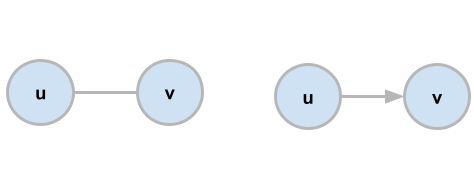
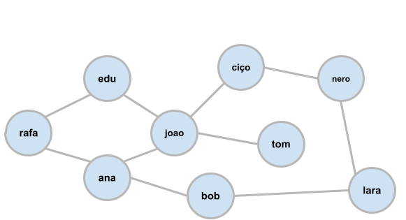
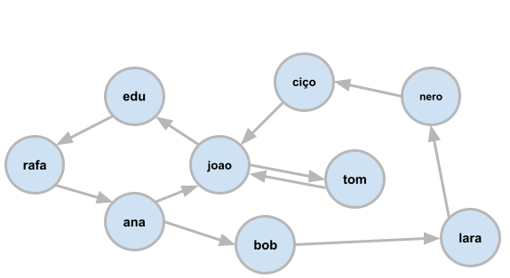

# Grafos

## Introdução

Em EDI vocês aprenderam a utilizar algumas estruturas de dados lineares e algumas estruturas de dados não-lineares. 

- Lineares:
    - ArrayList:
        - 
    - LinkedList:
        - 
    - DoublyLinkedList:
        - 
    - ArrayStack:
        - 
    - LinkedListStack:
        - 
    - ArrayQueue:
        - 
    - LinkedListQueue:
        - 
- Não-lineares:
    - Binary-search Tree:
        - 

Agora nós vamos estudar um outro tipo de ED não-linear, chamada **Grafo**. Segue uma ilustração do Tipo Abstrato de Dado para um Grafo.

Grafos, assim como árvores, são coleções de objetos (ou entidades) que chamamos de **nós ou vértices**, que são conectados entre si através de um conjunto de **arestas**. 
No entanto, quando se trata de árvores existem algumas regras para conectar dois nós.
Por exemplo: uma árvore com n nós deve possuir n-1 arestas; uma aresta para cada relação entre nó pai/mãe e nó filho.
Todos os nós em uma árvore tem um pai/mãe, exceto o nó raiz.
Em uma árvore todos os nós devem ser alcançados a partir da raiz, existindo apenas um caminho da raiz até o nó.
Por outro lado, grafos não possuem regras específicas para quantidade de nós, arestas, e relacionamentos. 
Um grafo contém um conjunto de nós e um conjunto de arestas, e as arestas podem conectar os nós de diversas formas.
No fim das contas, árvores são apenas casos especiais de grafos.

O estudo de grafos é referido por "Teoria dos Grafos".
Em termos matemáticos, podemos definir grafos como:
> Um grafo **G** é um par ordenado de um conjunto **V** de vértices e **E** de arestas (edges): **G = (V,E)**.

Obs: quando temos um par em que a ordem importa, estamos nos referindo a uma sequência, e nesses casos usamos parênteses **()** para defini-la. Quando a ordem de um par não importa, na verdade estamos nos referindo a um conjunto, e neste caso usamos chaves **{}** para expressá-lo.

Agora vamos reusar o exemplo anterior, mas desta vez daremos nomes/rótulos para cada vértice. 

Note que apesar de usar os rótulos v1, v2, v3, etc, não existe um indicação de ordem entre vértices. Eu poderia usar qualquer rótulo para os nós.

No exemplo anterior, teremos os seguintes conjuntos de vértices e arestas. 
- **V = {v1, v2, v3, v4, v5, v6, v7, v8, v9}**
- **E = {{v1,v2}, {v1,v3}, {v2,v4}, {v3,v4}, {v3,v5}, {v4,v6}, {v4,v7}, {v5,v9}, {v6,v8}, {v8,v9}}**

Note que pelo fato da ordem dos vértices em V não importar nós usamos {}.
O mesmo serve para a ordem das arestas em E.
Além disso, como esse grafo é não direcionado, então a ordem de representação das arestas também não importa, visto que, por exemplo, **{v1,v2} é equivalente à {v2,v1}**.
Se o grafo fosse direcionado, então precisaríamos representar as arestas usando parênteses, por exemplo, **(v1,v2)**, sabendo que **(v1,v2) NÃO é equivalente à (v2,v1)**. 

Segue ilustação de aresta direcionada e aresta não direcionada.

É possível termos um Grafo com os dois tipos de arestas, direcionadas e não-direcionadas. No entanto, nesta disciplina vamos estudar apenas Grafos que são completamente compostos por arestas direcionadas, e Grafos que são completamente compostos por arestas não-direcionadas.

| Grafo Não-Direcionado | Grafo Direcionado () |
| -------- | ---------- |
|  |  | 

Muitos problemas podem ser modelados usando grafos.
Grafos podem ser usados para representar quaisquer tipos de objetos ou entidades que possuam relacionamentos par-a-par.
- Lista de amigos em redes sociais.
    - Cada Usuário é representado por um nó.
    - Usuários que são amigos possuem relacionamento denotado por arestas.
    - Nesse caso arestas são não-direcionadas, pois amizade é um relacionamento mútuo (se eu sou seu amigo, você também é meu amigo).
    - 
    - A representação em grafos pode ajudar a sugerir novas amizades para um usuário específico. Como vocês projetariam este algoritmo? 
        - Sugerir amigos de amigos.
        - João: Rafa, Bob, e Nero.
    - Este é um problema bastante conhecido da Teoria dos Grafos: a partir de um nó origem, encontrar todos os nós que tenham menor caminho igual 2.
- Página interligadas (hyperlinks) na Internet.
    - Cada Página é representada por um nó.
    - Uma página A que tem um hyperlink para outra página B terá relacionamento representado por aresta direcionada: A⇾B. 
    - Nesse caso arestas são direcionadas, pois é possível sair de uma página A para outra página B sem que seja possível sair da página B para a página A.
    - 
    - Nesse contexto, um grafo de páginas web pode ser usado pelo google para fazer web crawling.
        - Motores de busca aplicam algoritmos de web-crawler, para sistematicamente navegar na World Wide Web e coletar páginas. Motores de busca poderão então usar esses dados para prover resultados acurados rapidamente para as buscas que fazemos.
        - Web-crawling é basicamente navegação em Grafos.

Por fim, precisamos citar que grafos podem ser compostos por arestas com peso ou por arestas sem peso.
Em algumas situações, é desejável explicitar que uma aresta é mais importante do que outras arestas, e isto pode ser feito definindo pesos para as arestas.
Grafos cuja arestas possuem peso são chamados de **grafos ponderados** (ou grafos valorados), e grafos nos quais as arestas não possuem peso são chamados de **grafos não-ponderados**.
Um exemplo de aplicação de grafos ponderados seria representar as distâncias entre cidades.

Qual seria o melhor caminho entre CG e Natal?
 - CG ⇾ Caicó ⇾ Natal = 472km
 - **CG ⇾ Mamanguape ⇾ Natal = 252km**
 - CG ⇾ JP ⇾ Natal = 322km
 - CG ⇾ JP ⇾ Pipa ⇾ Natal = 368km

 E se o grafo fosse não-ponderado? ...

 Note que grafos não-ponderados podem ser vistos como grafos ponderados, bastando atribuir os mesmos pesos à cada aresta.
 Da mesma forma, grafos não-direcionados podem ser vistos como grafos direcionados, bastando atribuirmos as duas direções para cada aresta. 

## Outras Propriedades

### Tipos de Arestas

No que diz respeito às arestas, podemos mencionar alguns tipos específicos de arestas como **laços** e **multi-arestas**.
Uma aresta é dita laço se os nós origem e destimo forem iguais.
Além disto, laços podem ser direcionados ou não, mas na verdade isto não mudaria em nada sua semântica.
Uma aresta pode ser considerada multi-aresta se houver outra aresta exatamente igual: partidno de um mesmo nó origem e chegando a um mesmo nó destino.
Por fim, multi-arestas podem ser direcionadas ou não-direcionadas, mas nesse caso, diferentemente do laços, o direcionamento altera a semântica do grafo.

Um caso de uso para laços é a representação de hyperlinks entre páginas.
Note que algumas páginas podem possuir um link para ela própria (geralmente o botão "home"; ex: gmail). 
- 

Um caso de uso para multi-arestas é a representação de vôos.
Embora multiplos vôos entre destinos A e B possuam o mesmo peso em termo de distância, talvez queiramos tornar explícito que existe mais de um vôo entre A e B, usando o nome do vôo e outros atributos relacionados a cada vôo/aresta.
- 

Se um grafo não contém laços ou multi-arestas, então podemos chamá-lo de **grafo simples**.
Na maioria dos casos vamos usar grafos simples.

### Número de Arestas

Agora vamos discutir um pouco sobre a relação entre quantidade de nós e arestas, considerando um grafo simples direcionado.

Considere um grafo com 4 nós.
- 
- O número mínimo de arestas é zero (|E|=0), pois podemos ter um grafo sem arestas.
- Com relação ao número máximo: experimente desenhar o máximo de arestas (direcionadas) no grafo anterior.
- 
- Você deve ter percebido que cada nó consegue ser conectado com os demais n-1 nós.
- Portanto, o **número máximo de arestas em um grafo simples direcionado é n\*(n-1)**.
- Se o grafo for não-direcionado, cada relação entre dois nós, que antes era representada por 2 arestas, passará a ser representada por 1 aresta.
- Portanto, o **número máximo de arestas em um grafo simples não=direcionado é n\*(n-1)/2**

Em resumo:
 - **0 <= |E| <= n\*(n-1)**, se o grafo for direcionado e simples
 - **0 <= |E| <= n\*(n-1)/2**, se o grafo for não-direcionado e simples

 Note que o número máximo de arestas tende a ser consideravelmente maior do que o número de vértices:
 - se |V|=10, |E|<=90
 - se |V|=100, |E|<=9900

Sobre o número de arestas, ainda podemos classificar um grafo como **denso** ou **esparso**.
Um **grafo denso** tem muitas arestas, geralmente próximo do máximo possível (mas há subjetividade).
Um **grafo esparso** tem poucas arestas, geralmente uma quantidade muito abaixo do máximo possível (mas há subjetividade).
Muitas decisões importantes são tomadas baseadas no tipo de grafo, se ele é denso ou esparso.
Grafos densos geralmente são armazenados e manipulados com **matrizes de adjacências**.
Grafos esparsos geralmente são armazenados e manipulados com **listas de adjacências**.

Grafos podem ter caminhos.
Um **passeio (walk)** é uma sequência de pares adjacentes conectados por uma aresta.
Observe o grafo que representa os links em páginas web.

Neste grafo, podemos citar todos os passeios possíveis partindo de A:
 - \<A,C,E,I,H\>
     - \<A\>
     - \<A,C\>
     - \<A,C,E\>
     - \<A,C,E,I\>
 - \<A,B,D,C,E,I,H\>
     - \<A,B\>
     - \<A,B,D\>
     - \<A,B,D,C\>
     - \<A,B,D,C,E\>
     - \<A,B,D,C,E,I\>
     - \<A,B,D,C,E,I,H\>
 - \<A,B,D,G\>
 - \<A,B,D,H,I\>
     - \<A,B,D,H\>

Todos os passeios citados anteriormente são **caminhos simples (simple paths)**, ou seja, passeios nos quais nenhum nó foi visitado repetidamente. 
Por exemplo, o passeio \<A,B,D,G,D,B,A\> não é considerado caminho pois existem nós repetidos.
Por fim, existem as **trilhas**: um passeio sem arestas repetidas, mas pode conter nós repetidos.
Vamos usar o exemplo de relacionamentos em redes sociais.

- 
- passeio que é um caminho simples: \<rafa,edu,joao,ciço\>
- passeio que é um caminho simples: \<rafa,ana,bob,lara,nero\>
- passeio que não é um caminho simples (é uma trilha): \<tom,joao,ciço,nero,lara,bob,ana,joao,edu\>
- note que a trilhar acima pode ser convertida em passeio simples, saindo da mesma origem e chegando ao mesmo destino: \<tom,joao,edu\>

Como trilhas podem ser convertidas em caminhos simples, geralmente o termo mais usado é **caminho (simples)**.

Um grafo é **conectado** se existe um caminho entre todos os nós.
Se o grafo for direcionado e existe um caminho entre todos os nós, então dizemos que o grafo é **fortemente conectado**.
Se o grafo for direcionado e não existe um caminho entre todos os nós, então dizemos que o grafo é **fracamente conectado**.

|  |   | 
| -------- | ---------- | 

 | |
| -------- | ---------- | 

Conectividade em um grafo é uma propriedade muito importante, visto que permitirá através de caminhos partir de qualquer nó como origem e chegar em qualquer nó como destino. 

Um passeio é considerado um **passeio fechado**, se iniciar e terminar no mesmo nó. 
Além disso, deve possuir comprimento (número de arestas) maior do que zero.
Ex: \<ana,joao,edu,rafa,ana>.
Um **ciclo simples** começa e termina no mesmo nó, mas não tem repetição além dos nós inicial e final.

Um grafo sem ciclo é chamado de **grafo acíclico**.
Grafos acíclicos podem ser não direcionados ou direcionados (directed acyclic graph - DAG).
Por exemplo: uma árvore na qual as arestas não possuem direção é um grafo acíclico não direcionado.

 | |
| -------- | ---------- | 